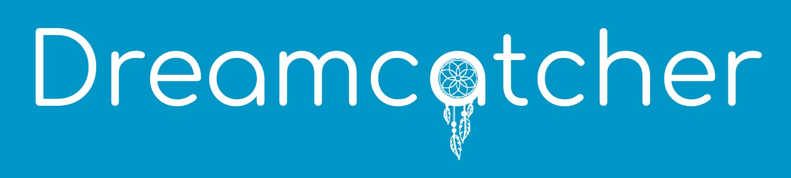

<!-- PROJECT LOGO -->
<br />
<p align="center">
  <a href="https://github.com/roshanlam/ReadMeTemplate/">
    
  </a>

  <h3 align="center">Dreamcatcher - Personal Job Tracking Tool</h3>

  <p align="center">
    Get help on your path to acquire your dream job
    <br />
    <a href="https://youtu.be/4_YIT2BbuLA">View Demo</a>
    ·
    <a href="https://youtu.be/4ABw-JlAAco">View a 30 second advertisement</a>
    ·
    <a href="/dreamcatcher-ui-react/src/docs/Dreamcatcher - Executive Summary.pdf">View Executive Summary</a>
  </p>
</p>


<!-- TABLE OF CONTENTS -->
## Table of Contents

- [Table of Contents](#table-of-contents)
- [About The Project](#about-the-project)
  - [Built With](#built-with)
- [Getting Started](#getting-started)
  - [Prerequisites](#prerequisites)
  - [Installation](#installation)
- [Usage](#usage)
- [Roadmap](#roadmap)
- [Contact](#contact)


<!-- ABOUT THE PROJECT -->
## About The Project

Dreamcatcher is a community-driven job application tracker where users can search through and keep track of multiple job applications and get more information from their peers about new opportunities.

Using Dreamcatcher, users can:
* Track and filter applications
* Get useful metrics about their job applications
* Share their interview experiences and new job positions with the community
* Discuss various topics with your peers and give their opinions

### Built With
* [React](https://reactjs.org/)
* [Node.js](https://nodejs.org/en/)
* [Express](https://expressjs.com/)
* [Firebase](https://firebase.google.com/)


<!-- GETTING STARTED -->
## Getting Started

To get a local copy up and running follow these simple steps.

### Prerequisites
* npm
```sh
npm install npm@latest -g
```

### Installation

1. Register for Firebase and create a new project 
2. Register a new web app 
3. Copy the Firebase SDK config details into the .env_demo file 
4. Rename .env_demo to .env
5. Clone the repo
```sh
git clone https://github.com/PyroGenesis/Dreamcatcher.git
```
5. Install NPM packages
```sh
npm install
```

<!-- USAGE EXAMPLES -->
## Usage

<details>
<summary> 1. Add a new position </summary>

</details>

<details>
<summary> 2. Update application status </summary>

</details>

<details>
<summary> 3. Update Profile Info </summary>

</details>

<details>
<summary> 4. Add experience and education details </summary>

</details>

<details>
<summary> 5. Create forum post </summary>

</details>

<details>
<summary> 6. Add comments to forum posts </summary>

</details>


<!-- ROADMAP -->
## Roadmap
* Deploy Dreamcatcher on the cloud using AWS
* Create a browser extension to easily add new positions in the Dreamcatcher database

<!-- CONTACT -->
## Contact

Yash Kulkarni - [LinkedIn](https://www.linkedin.com/in/yashkulkarni97/)  \
Burhanuddin Lakdawala - [LinkedIn](https://www.linkedin.com/in/burhanuddin-lakdawala/)  \
Anand Deshpande - [LinkedIn](https://www.linkedin.com/in/anand-deshpande10)

Project Link: [https://github.com/PyroGenesis/Dreamcatcher](https://github.com/PyroGenesis/Dreamcatcher)
